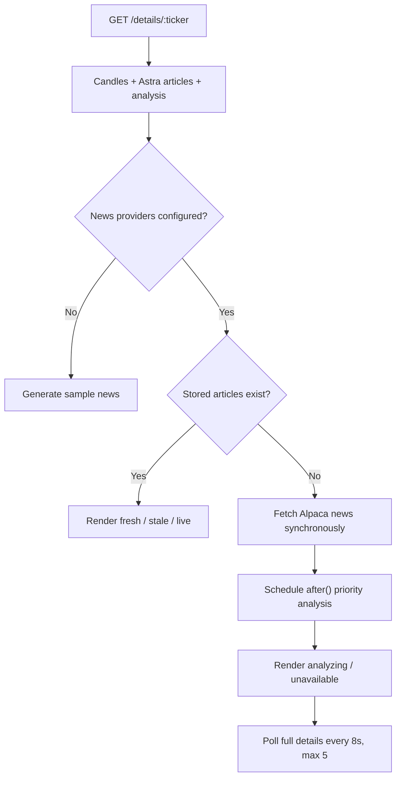
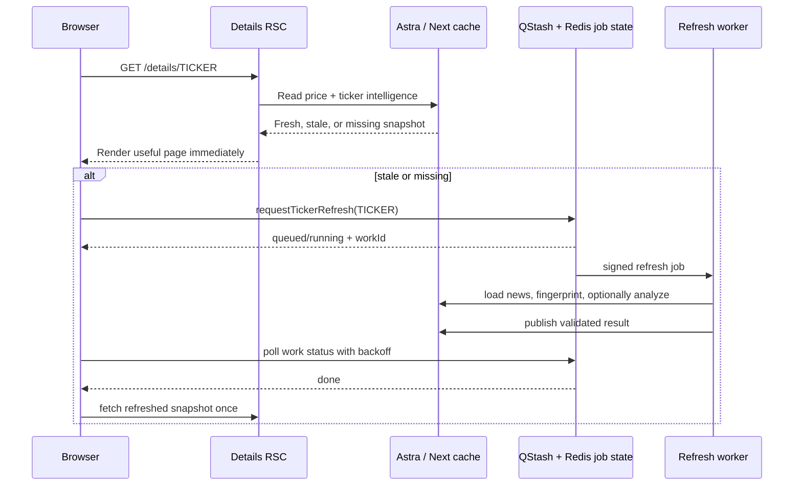
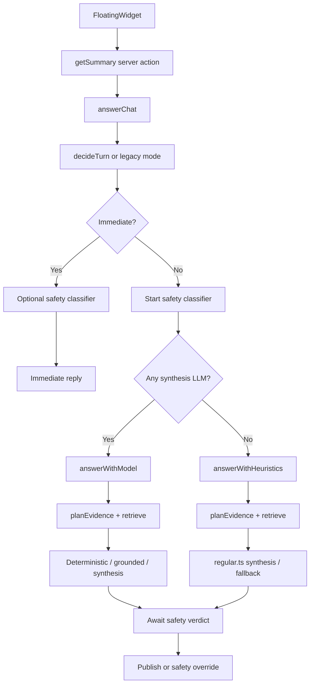
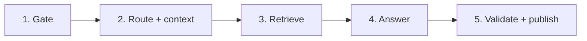
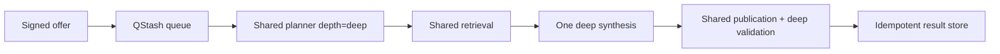
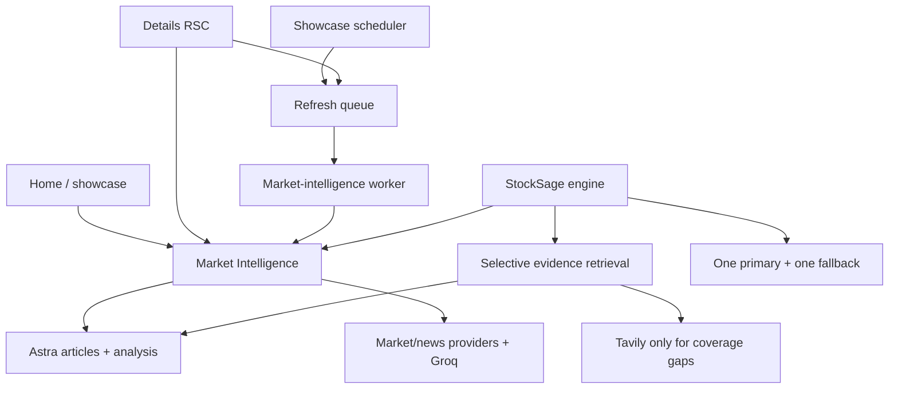

# TradeIntel architecture redesign

**Status:** Historical design record; implemented architecture is documented in `architecture.md`
**Date:** 4 August 2026  
**Scope:** `/details/[id]`, ticker intelligence, StockSage, scheduled work, caching, and Langflow

## Problem context

TradeIntel’s application code (frontend, auth, Astra storage, request guards)
was largely sound. The failure mode that forced this redesign was external and
operational: free-tier dependencies that the product treated as production
critical.

What broke in practice:

- The Neon project backing the Hugging Face Langflow Space exhausted its free
  compute quota (roughly 100 CU-hours/month). The Space entered a runtime error
  state, so Langflow-first analysis and keep-warm paths stopped working.
- Public Space runtime logs exposed the Neon connection string, creating an
  immediate credential-rotation incident on top of the outage.
- It was unclear whether QStash news and keep-warm schedules were still live;
  GitHub Actions no longer owned the recurring cron after the move to QStash.
- `/details/[id]` pages showed missing analysis or verdicts roughly a month
  old. Priority analysis only ran for completely cold tickers, and the
  universe-wide cron could not honor the three-day analysis TTL across ~12,500
  symbols.
- StockSage became hard to calibrate because shared news evidence was stale or
  absent, and the chat stack still contained two overlapping executors plus
  Langflow fallbacks.

Project constraints that shaped the response:

- Free-tier infrastructure remains a hard requirement.
- User experience is the top priority for a public GitHub showcase.
- The codebase may be reviewed by FAANG recruiters and engineers, so the
  redesign must show judgment under constraints, not just more orchestration.

That combination—external free-tier collapse, stale ticker intelligence, and a
showcase audience—prompted a redesign around demand-driven computation, a small
prewarmed showcase set, last-known-good delivery, and Langflow as an optional
adapter rather than a load-bearing runtime.

## Executive decision

TradeIntel should have one shared market-intelligence system and one StockSage
conversation engine.

The market-intelligence system has two triggers but only one implementation:

1. A 30-minute scheduler refreshes the ten tickers intentionally showcased by the
   product.
2. A user visiting any other ticker requests the same refresh job on demand.

Neither trigger performs provider or LLM work inside the page request. Both
publish a deduplicated background job. The page always reads the store first,
keeps last-known-good content visible, and observes durable job state.

StockSage becomes one bounded five-stage engine:

1. Gate
2. Route and context
3. Retrieve evidence
4. Answer
5. Validate and publish

Deep Research reuses those stages with a larger asynchronous budget. It is not
a second conversation architecture.

Direct Groq becomes the production analysis path. Langflow remains in the
repository as an optional, manually enabled adapter and benchmark artifact. It
is not called automatically by ticker analysis, regular StockSage, or Deep
Research.

## Why this decision was selected

Nine independent reviews were run across systems architecture, reliability,
details-page behavior, distributed caching, StockSage, UX, migration safety,
adversarial failure analysis, and hiring-signal quality.

They converged on the following:

- The universe-wide cron cannot meet its own freshness contract.
- A day-old result must never be deleted before replacement.
- Long-tail work must be durable and asynchronous, not `after()` work or a
  synchronous page dependency.
- The current StockSage contains two partially overlapping architectures.
- Safety, evidence filtering, citations, latency budgets, and deep-job
  idempotency are valuable and must survive the simplification.
- Langflow is a useful adapter to demonstrate, but a poor free-tier production
  dependency.

The reviews disagreed in three areas. This report resolves them as follows:

1. **Keep or remove long-tail cursor rotation:** remove it after the on-demand
   worker is live. Searching 12,522 symbols is useful; precomputing all of them
   is not.
2. **Introduce immutable snapshot pointers:** do not introduce that complexity
   initially. Extend the existing per-ticker analysis document with generation
   and fingerprint fields, use queue single-flight, and reject obsolete worker
   writes.
3. **Delete advanced entity and temporal behavior:** preserve it behind one
   `resolveTurnContext()` boundary during migration. Remove only behavior proven
   unnecessary after parity tests and product measurement.

---

# 1. New `/details/[id]` pipeline

The route remains `/details/[id]`; `id` is normalized as a ticker.

## 1a. Current pipeline

### Current request path

`src/app/details/[id]/page.tsx:46-53` calls:

```text
getDetailsData(id, triggerPriorityAnalysis)
```

`getDetailsData()` reads three things in parallel
(`src/lib/market-data/queries.ts:261-282`):

- price/candles from the market-data cache and providers;
- stored articles from Astra;
- the stored analysis document from Astra.

It then branches:



The cold branch is not read-only:

- `src/lib/market-data/queries.ts:303-307` fetches Alpaca news during the page
  request.
- `src/app/details/[id]/priority.ts:14-24` schedules background work using
  `after()`.
- `src/lib/market-data/analysis.ts:228-273` loads Polygon news, falls back to
  Alpaca, writes Astra, and analyzes the ticker.

Priority analysis only runs if both conditions are true:

- article count is zero;
- no analysis document exists.

Therefore:

- a ticker with articles but no verdict never self-heals on a page visit;
- a ticker with a stale verdict never refreshes on a page visit;
- an old partial analysis document can permanently block priority analysis.

The page reports `"analyzing"` when `after()` was scheduled, not when durable
work was accepted. `DetailsView` then polls the entire details payload every
eight seconds up to five times (`DetailsView.tsx:125-159`). `"live"` is treated
as terminal, so polling can stop after articles arrive but before the verdict
arrives.

### Current cron path

`src/app/api/cron/news/route.ts` currently:

1. advances a Redis cursor across `universe.json`;
2. chooses eight tickers on weekdays and four on weekends;
3. loads Polygon news sequentially with 13-second spacing;
4. attempts up to three analyses with 65-second spacing;
5. prunes articles older than 90 days;
6. globally invalidates the `news` cache tag after writes.

QStash is intended to invoke it every 20 minutes
(`scripts/setup-qstash.ts:51-69`). Vercel invokes it daily as a backstop
(`vercel.json:4-8`).

This design has no dedicated showcase lane. At the configured rate:

- a news rotation across 12,522 symbols takes about 25 days including weekend
  throttling;
- the theoretical analysis rotation is at least 58 days at three analyses per
  run;
- observed run timing makes roughly two analyses per run and an approximately
  87-day analysis rotation more realistic.

That cannot satisfy `ANALYSIS_TTL_DAYS = 3`
(`src/lib/market-data/analysis.ts:33`).

### Current storage and cache behavior

Articles:

- use stable URL-derived IDs;
- are upserted into Astra;
- retain AI labels when provider articles are reloaded;
- are pruned after 90 days by publication date.

Analysis:

- is stored per ticker in `stock_analysis`, with a news-collection fallback;
- writes `analyzed_at` only after a fully validated LLM response;
- writes `concluded_at` after every successful atomic conclusion, including
  unchanged-analysis reuse and no-news;
- preserves the previous verdict if analysis fails.

Next cache:

- candles: 300 seconds, global `candles` tag;
- articles: 600 seconds, global `news` tag;
- analysis document: 600 seconds, global `news` tag.

These are good last-known-good foundations, but the cache invalidation is too
coarse and article/verdict reads can represent different generations.

## 1b. Target pipeline

### One service, two triggers

Create one market-intelligence service:

```text
requestTickerRefresh(ticker, source)
```

Valid sources:

```text
showcase_cron | user_request | manual
```

Both cron and user requests publish the same deduplicated refresh job. They do
not implement separate ingest or analysis logic.

### Canonical showcase set

Replace the separate home, fallback, and cron-warmup concepts with one
`SHOWCASE_TICKERS` definition.

The existing `FALLBACK_TICKERS` already contains ten reasonable symbols:

```text
AAPL, MSFT, NVDA, TSLA, AMZN, GOOGL, META, NFLX, AMD, IBM
```

The final landing-page options, homepage data, cron refresh, and prefetch hints
must all derive from this one list. The current home mock list contains only
AAPL, TSLA, NVDA, and MSFT (`src/data/mockStocks.ts`), which must be reconciled.

### Showcase scheduler

Recommended cadence: every 30 minutes.

Price freshness remains independent and uses short request-time caches.
The 30-minute cadence produces 480 refresh jobs/day for ten tickers and leaves
headroom inside the strict one-hour conclusion SLO. Unchanged fingerprints
avoid model calls, while on-demand work retains a separately enforced budget.

The scheduler:

1. iterates `SHOWCASE_TICKERS`;
2. publishes one deduplicated refresh job per ticker;
3. records selected, deduplicated, queued, and failed counts;
4. performs no Polygon or Groq work itself.

The daily Vercel job becomes a maintenance/backstop job rather than another
four-minute universe pass.

### Long-tail request path

The details page becomes store-first and provider-write-free:



“On demand” means the visit requests durable work. It does not mean the page
waits for Polygon, Alpaca, or Groq.

### Fresh, stale, missing, and failure behavior

#### Fresh

Conditions:

- the latest successful system conclusion and its provider check are within
  their freshness window;
- the stored analysis fingerprint matches the current article fingerprint.

The freshness window is one hour. `concluded_at` advances after every successful
atomic conclusion; `analyzed_at` may be older when a current provider check
confirms that the fingerprint is unchanged.

Behavior:

- return immediately;
- perform no queue or model work;
- show the user-facing conclusion time as “AI analysis updated”.

#### Stale

Conditions:

- usable articles/verdict exist and the last successful check is more than one
  hour but less than 48 hours old; or
- analysis does not match the current article fingerprint.

Behavior:

- return all last-known-good content immediately;
- enqueue or join a refresh job after first paint;
- display `Updating` without hiding articles or the verdict;
- atomically replace the complete published bundle only after validation
  succeeds.

At 48 hours the previous bundle is hard-expired: it is retained in storage but
is not presented as current. The page keeps independent price/chart content and
shows `Preparing current coverage`.

#### Missing

Conditions:

- there is no usable stored intelligence.

Behavior:

- return price/chart if available;
- render `Preparing coverage for TICKER`;
- enqueue a refresh;
- poll durable job state;
- publish a successful `no_news` result if providers return zero articles.

No fabricated news should be shown in production.

#### Provider or model failure

If last-known-good data exists:

- keep it visible;
- mark it `degraded`;
- show its age and a restrained recovery message;
- retry with queue backoff, then enforce a short cooldown after terminal
  failure.

If no stored data exists:

- show a terminal unavailable state with retry timing;
- do not show an endless analyzing state;
- use a short negative-cache/cooldown to prevent request storms.

#### Rate-limited

- retain the existing page;
- expose `retryAfterSec`;
- do not replace good content with the synthetic unavailable shell currently
  returned by `fetchDetails()`.

### Refresh worker

The signed worker performs:

1. normalize and validate the ticker;
2. acquire a Redis single-flight lock;
3. read existing articles and analysis metadata;
4. refresh news only when the news-check window is stale;
5. upsert articles by stable ID;
6. compute a deterministic content fingerprint;
7. skip LLM analysis if the analysis fingerprint is unchanged;
8. otherwise run direct lightweight Groq analysis;
9. validate the response;
10. atomically update the per-ticker analysis document;
11. invalidate ticker-scoped cache entries;
12. release the lock and persist terminal job state.

The lock must be released on failure. The current ten-minute rate-limit claim
(`analysis.ts:197-200`) is not sufficient because failed work remains blocked
until the window expires.

### Fingerprint and freshness semantics

Do not delete articles or verdicts because they are one day old.

Keep:

- articles for 90 days by publication date;
- the last successful verdict until a validated replacement exists.

Add:

```text
content_fingerprint =
  hash(schema_version + ticker + sorted(article_id + publication_date + content_revision))

analysis_fingerprint =
  hash(content_fingerprint + prompt_version + model + response_schema_version)
```

Refresh rules:

- age expires the successful **system conclusion** and its provider check, not
  stored content;
- changed `content_fingerprint` triggers analysis;
- changed prompt/model/schema triggers analysis;
- unchanged inputs reuse the previous analysis even if `analyzed_at` is old;
- a provider failure never changes the current successful fingerprint.

Recommended analysis-document additions:

```text
pipeline_version
content_fingerprint
analysis_fingerprint
news_checked_at
concluded_at
last_success_at
refresh_requested_at
refresh_source
generation
last_error_code
analysis_status
published_article_ids
published_article_labels
```

The worker upserts candidate articles first, then compare-and-set publishes the
analysis document last. Readers display only `published_article_ids`, so staged
rows cannot appear beside an older verdict. Before writing, a worker verifies
that the generation still exactly matches what it read. This provides one
sequential publication point without introducing immutable snapshot storage.

### Job identity and state

Use a unique durable `workId` plus one active Redis record per normalized
ticker:

```text
market-intelligence:refresh:active:<ticker> -> workId
market-intelligence:refresh:job:<workId>    -> job state
```

Repeat visits join the active `workId`. QStash uses that same ID for delivery
deduplication. Failed jobs remain joinable only for their cooldown, then a new
`workId` may be reserved; a freshness bucket never blocks a valid retry.

After news is loaded, the content fingerprint determines whether LLM work is
needed.

Job states:

```text
queued | running | done | failed
```

Store:

```text
workId
ticker
state
requestedAt
startedAt
completedAt
retryAfterSec
errorCode
```

Do not infer job state from whether articles have appeared.

### Details UI contract

Separate content state from refresh state:

```text
content: empty | available | unavailable
refresh: idle | queued | running | failed
```

Derived UX:

| Content | Refresh | UI |
|---|---|---|
| available | idle | Normal fresh view |
| available | queued/running | Keep content visible; show Updating |
| available | failed | Keep content; show age and retry |
| empty | queued/running | Preparing coverage skeleton |
| empty | failed | Honest unavailable state |
| unavailable | failed | Provider unavailable with retry timing |

Replace the current eight-second, five-attempt whole-page poll with:

```text
2s, 4s, 8s, 15s, then 30s
```

Stop active polling after approximately two minutes and show “finishing in the
background.” When the job completes, fetch the details snapshot once.

### Details API and module boundaries

Recommended public boundaries:

```text
getTickerDetails(ticker)           // read-only composition
requestTickerRefresh(ticker)       // auth + rate limit + deduplicated enqueue
getTickerRefreshStatus(workId)     // read-only job status
runTickerRefreshJob(payload)       // signed internal worker
enqueueShowcaseRefreshes()         // scheduler
```

Recommended files:

```text
src/lib/market-intelligence/
  types.ts
  showcase.ts
  repository.ts
  service.ts
  queue.ts
  worker.ts

src/app/api/market-intelligence/refresh/route.ts
src/app/api/cron/showcase/route.ts
```

Existing provider adapters under `src/lib/market-data/` should remain provider
adapters rather than being rewritten.

Move `StockData` out of `src/app/details/[id]/page.tsx`. A library currently
imports an app-layer type, which reverses the intended dependency direction.

### What is removed from the old details pipeline

Remove after the new path is live:

- `src/app/details/[id]/priority.ts`;
- page-level `after()` dispatch;
- `requestPriorityAnalysis()` from
  `src/lib/market-data/analysis.ts:228-273`;
- synchronous cold Alpaca-news fetching from the details request;
- `fetchColdAlpacaNews()` in `queries.ts`;
- full-universe cursor selection and `advanceCursor()` from the cron route;
- weekend universe-batch logic;
- cron-inline Polygon and Groq execution;
- five-attempt polling that infers status from the full details payload;
- automatic Langflow-first analysis;
- the default Langflow keep-warm schedule;
- global news/candle cache invalidation where ticker-scoped invalidation applies.

### What is retained and changed

Retain:

- stable article IDs and idempotent upserts;
- AI-label protection;
- 90-day article retention;
- Astra as the store of record;
- `analyzed_at` only on full success;
- provider breakers;
- rate limits;
- cached prices/candles;
- lazy chart ranges;
- independent related-stock loading;
- `mergeDetails()` last-known-good semantics.

Change:

- cold-only priority becomes cold-or-stale durable refresh;
- age-based analysis TTL becomes conclusion age, provider-check age, and input
  fingerprint;
- global tags become ticker-scoped tags;
- optimistic boolean `analyzing` becomes durable job state;
- full-universe cron becomes showcase-only scheduling;
- viewport-triggered related stocks become an eager server request streamed
  through Suspense.

### Details acceptance criteria

- Cached details page p95 first response: at most 1.5 seconds.
- No page request performs Polygon news ingestion or LLM analysis.
- Refresh enqueue p95: at most 300 ms.
- Showcase conclusion and provider-check age: at most one hour while the
  scheduler is healthy; normally below 35 minutes.
- A stale page always remains usable during refresh or provider failure.
- A cold ticker reaches a verdict, `no_news`, or honest failure within 90
  seconds at p95; UI stops making active promises by 120 seconds.
- Duplicate visits to the same ticker produce one job.
- Failed work releases its lock.
- An obsolete worker cannot overwrite a newer successful result.
- Production never substitutes sample data for failed live data.

---

# 2. New StockSage module

## 2a. Current module

> **Historical pre-unification snapshot.** This subsection records the legacy
> architecture that existed before the rollout cleanup. File names, flags,
> dual executors, shadow behavior, and inline paths below are intentionally
> obsolete and are not descriptions of the current runtime.

StockSage currently has approximately 55 TypeScript files and 11,700 lines
under `src/lib/stocksage`.

### Current regular-chat path



The public entry is `src/lib/stocksage/chat.ts:34-149`.

It:

- normalizes input;
- builds conversation state;
- optionally runs `decideTurn()` depending on
  `STOCKSAGE_TURN_DECISION=off|shadow|on`;
- handles crisis and immediate routes;
- starts the safety classifier;
- chooses either `answerWithModel()` or `answerWithHeuristics()`;
- waits for safety only after answer work has completed.

### Current duplication

Routing exists in several places:

- `turn-decision.ts`;
- `intent.ts`;
- `chat-heuristics.ts` legacy classification;
- parts of `chat-model.ts` that re-derive social/data/off-topic flags.

Regular execution exists in two stacks:

```text
chat-model.ts
  + chat-model-deterministic.ts
  + chat-model-synthesis.ts

chat-heuristics.ts
  + regular.ts
```

Both stacks:

- plan evidence;
- retrieve;
- build prompts;
- create deterministic answers;
- synthesize;
- validate citations and figures;
- create Deep Research offers;
- implement fallback behavior.

Publication checks are repeated across:

- `regular.ts`;
- `chat-model-synthesis.ts`;
- `deep.ts`.

The synthesis layer can try six provider/model candidates
(`src/lib/stocksage/synthesis.ts:90-148`) and can make a correction call for
each candidate. This complexity rarely fits the five-second regular budget.

### Current evidence behavior

The strongest current subsystem is the typed evidence pipeline:

- `planning.ts` builds a bounded provider plan;
- `retrieve.ts` enforces a 2.2-second regular retrieval ceiling;
- `evidence.ts` filters authority, freshness, entity match, criteria, duplicates,
  and unsafe sources;
- citations and figure/proxy checks constrain publication.

However, the current evidence cache is not cache-first.
`retrieve.ts:196-229` reads cached evidence concurrently with Astra, Tavily,
quotes, and fundamentals, then merges everything. A cache hit therefore does
not necessarily save provider work.

### Current entity and temporal behavior

Conversation context supports:

- named and ordered entity sets;
- groups;
- pronoun and former/latter references;
- comparison follow-ups;
- corrections and subset narrowing;
- normalized US/Australian market intervals and calendars.

This is sophisticated but spread across many files. It should first be hidden
behind one context API rather than deleted during the executor migration.

### Current Deep Research path

Deep Research:

1. creates a signed immutable snapshot;
2. enqueues with QStash when available;
3. otherwise falls back to a synchronous 120-second execution;
4. performs broader planning and retrieval;
5. tries direct synthesis;
6. can invoke Langflow;
7. falls back to a deterministic evidence report;
8. validates and stores the result;
9. is polled every two seconds by the client.

The signed snapshot, job idempotency, validation, and non-destructive base
answer are good. Synchronous fallback, duplicate planning logic, aggressive
polling, and automatic Langflow fallback are not.

## 2b. Target module

### One public engine

StockSage should expose a small public API:

```text
answerChat(request)
enqueueDeepResearch(snapshot)
getDeepResearchStatus(workId)
```

`answerChat()` uses one engine, not model and heuristic executors.

### Five-stage regular pipeline



#### Stage 1: Gate

Responsibilities:

- parse and bound request data;
- normalize text;
- apply user rate limits;
- deterministic crisis detection;
- deterministic hard policy floors.

No market or model provider is called for crisis, prohibited, or unsupported
instant outcomes.

Retain:

- `crisis.ts`;
- hard policy logic from `policy.ts`;
- request parsing and `guard()`.

#### Stage 2: Route and context

Produce one immutable `Turn` containing:

- one `TurnDecision`;
- normalized entities;
- requested criteria;
- normalized temporal intervals;
- retrieval and synthesis authorization;
- clarification or immediate response where applicable.

All later stages consume this frozen result. They may not reclassify intent,
policy, or retrieval authorization.

Make `decideTurn()` authoritative and remove the permanent off/shadow/on
migration mode after parity.

Expose the current entity and temporal system through:

```text
resolveTurnContext(request) -> TurnContext
```

Do not simplify advanced context behavior in the same change as executor
consolidation. After the unified engine is stable, measure whether groups,
former/latter references, and full holiday calendars justify their maintenance
cost.

#### Stage 3: Retrieve evidence

Use a cache-first coverage algorithm:

1. read the shared market-intelligence snapshot and Redis evidence cache;
2. read current quotes when the route requires them;
3. measure entity and criterion coverage;
4. call Astra/Tavily/fundamentals only for uncovered requirements;
5. filter and rank through the existing evidence rules;
6. return one typed `EvidenceBundle`.

This changes the current “cache and every provider in parallel” approach into a
true read-through strategy.

StockSage does not ingest Polygon/Alpaca news and does not maintain a second
news corpus. If shared ticker intelligence is cold, it may request the same
market-intelligence refresh job while answering from available quote/web
evidence.

Retain:

- `planning.ts`;
- `retrieve.ts`;
- `evidence.ts`;
- evidence diagnostics;
- citation source identity;
- retrieval deadlines.

Change:

- add source revision/fingerprint to evidence cache keys;
- avoid Tavily when shared evidence already covers the requested entities and
  criteria;
- add `depth: regular | deep` to the planner rather than maintaining a separate
  deep query planner.

#### Stage 4: Answer

Use one answer executor:

1. publish a deterministic answer when the evidence and request permit it;
2. otherwise make one bounded primary synthesis attempt;
3. optionally try one configured fallback provider;
4. if both fail or budget is exhausted, publish a deterministic grounded
   fallback.

No separate no-LLM executor is needed. The same executor simply skips synthesis
when no model is configured.

Regular chat should not perform a default correction cascade. Deep Research may
use one correction pass when validation identifies a repairable defect and
budget remains.

Reduce the synthesis chain from six candidates to:

```text
primary: Groq
fallback: one configured vendor/model
```

The specific fallback remains configuration, not a second orchestration tree.

#### Stage 5: Validate and publish

Use one publication contract for regular and deep answers:

- citation IDs resolve to validated sources;
- current-world claims are cited;
- requested entities and criteria are covered or limitations are stated;
- numeric claims are supported;
- proxy/ADR instruments are labelled;
- investment-direction and misconduct policy is respected;
- internal jargon and phantom attribution are rejected;
- output is converted to the `ChatReply` wire format;
- a signed Deep Research offer is created only when eligible.

Safety classifier behavior:

- instant crisis and hard refusal outputs remain deterministic;
- for supported non-instant turns, start the classifier in parallel with
  retrieval;
- await the classifier before synthesis and publication;
- do not spend a synthesis call on an input the classifier has rejected.

### Target Deep Research pipeline

Deep Research remains asynchronous:



Rules:

- no synchronous fallback when the queue is unavailable;
- preserve the regular answer and show Deep Research as temporarily
  unavailable;
- reuse the same planner, retrieval, evidence filters, and publication guards;
- use one deep synthesis attempt and at most one correction;
- retain deterministic evidence-report fallback;
- remove automatic Langflow synthesis;
- poll with backoff instead of every two seconds.

### Langflow's target role

Keep:

- `langflow/stocksage-analysis.json`;
- a small `LangflowAnalysisProvider`;
- flow/prompt synchronization tooling;
- a benchmark or manual script comparing direct and Langflow analysis.

Archive or remove:

- `langflow/stocksage-chat.json` once confirmed unused;
- Langflow chat-specific environment variables;
- automatic Langflow-first batch analysis;
- Langflow fallback in Deep Research;
- the default keep-warm schedule and workflow.

Production behavior:

```text
DirectGroqAnalysisProvider -> default
LangflowAnalysisProvider   -> explicit manual/evaluation opt-in only
```

This preserves the technical showcase while making production reliability
independent of Hugging Face and Neon.

### Target StockSage file structure

```text
src/lib/stocksage/
  engine.ts
  router.ts
  safety.ts
  context.ts
  answer.ts
  publication.ts
  synthesis.ts
  types.ts
  budget.ts
  telemetry.ts

  evidence/
    planner.ts
    retrieve.ts
    cache.ts
    filters.ts

  deep/
    queue.ts
    worker.ts
    snapshot.ts
    store.ts
    validation.ts
```

This is a target ownership map, not a requirement to rename everything in one
commit.

### StockSage file disposition

#### Retain or adapt

- `crisis.ts`;
- `policy.ts`;
- `safety-classifier.ts`;
- `types.ts`, especially the frozen `TurnDecision` contract;
- entity catalog and current entity/temporal resolution behind `context.ts`;
- `planning.ts`, `retrieve.ts`, `evidence.ts`, `evidence-cache.ts`;
- `citations.ts`, `figures.ts`, `rounding.ts`;
- `budget.ts`, breakers, admission controls, and telemetry;
- `grounded-answer.ts` and deterministic fallbacks, consolidated under
  `answer.ts`;
- `deep-snapshot.ts`, `deep-store.ts`, `deep-validation.ts`, and signed worker
  verification.

#### Merge

- `chat.ts` plus authoritative routing orchestration -> `engine.ts`;
- authoritative portions of `turn-decision.ts` and `intent.ts` -> `router.ts`;
- `chat-model.ts`, `chat-heuristics.ts`, `regular.ts`,
  `chat-model-deterministic.ts`, and `chat-model-synthesis.ts` ->
  `answer.ts`;
- `regular-guards-core.ts`, `regular-guards-evidence.ts`, and deep shared
  checks -> `publication.ts`;
- duplicate regular prompt builders -> one prompt builder;
- deep hardcoded extra queries -> `planner({ depth: "deep" })`.

#### Delete after parity

- `STOCKSAGE_TURN_DECISION=off|shadow` and shadow logging;
- `legacyClassification()` from `chat-heuristics.ts`;
- `turnFromRoute()` bridge;
- independent public `routeMessage()` classification;
- the legacy heuristic executor;
- the duplicate model executor files after their logic is consolidated;
- duplicate synthesis/publication guard blocks;
- automatic Langflow deep synthesis;
- synchronous Deep Research fallback;
- unused Langflow chat flow and chat-node configuration.

Do not delete the old files until golden tests demonstrate parity and the new
engine has a temporary rollback seam.

### StockSage UX states

Expose enough route/status information for the widget to render distinct
experiences:

| Mode | UX |
|---|---|
| social | Lightweight conversational reply; no citations or Deep action |
| clarification | Explicit question with entity/criterion choice chips |
| stable finance | Definition/explanation without fake live-evidence chrome |
| current finance | Evidence-backed answer with source and coverage status |
| comparison | Structured multi-entity answer with coverage for each entity |
| limited evidence | Useful answer plus a clear limitation |
| no evidence | Honest inability to verify; retry or Deep when eligible |
| deep pending | Keep regular answer; show progressive research status |
| deep failed | Keep regular answer; show non-destructive retry |

Extend `ChatReply` with a stable presentation mode/reason rather than forcing
the client to infer it from prose.

### StockSage acceptance criteria

- Instant social, clarification, and refusal responses p95 <= 500 ms.
- Regular finance p95 <= 5 seconds.
- Retrieval remains <= 2.2 seconds.
- Deep enqueue p95 <= 300 ms.
- Deep work completes or returns an honest terminal failure within 120 seconds.
- Crisis and hard-policy routes never call market or model providers.
- Executors never reclassify a frozen turn.
- Cache hits avoid unnecessary Tavily calls.
- Regular synthesis attempts at most two configured candidates.
- Every published research claim maps to a validated citation.
- Comparison answers cover every requested entity or explicitly state gaps.
- Queue outage never turns Deep Research into a synchronous interactive
  request.
- Langflow call count in default production mode is zero.

---

# 3. Shared architecture

The target dependency direction is:



Ownership rule:

- Market Intelligence owns ticker news, article storage, ticker analysis,
  freshness, and refresh jobs.
- Details composes and displays Market Intelligence.
- StockSage reads Market Intelligence and selectively adds evidence; it does
  not ingest a second copy of ticker news.
- Langflow is an adapter outside the default runtime dependency graph.

---

# 4. Migration plan

## Phase 0: external security and operations

- Rotate the Neon credential exposed by the public Hugging Face runtime error.
- Pause or private the broken Space until credentials are replaced.
- Verify QStash schedules and Vercel cron execution history.

## Phase 1: characterization

- Add golden ticker-pipeline tests for fresh, stale, missing, in-flight,
  provider failure, and LLM failure.
- Preserve the current StockSage acceptance, safety, state, temporal,
  retrieval, latency, and deep tests.
- Record warm/cold latency and provider-call baselines.

## Phase 2: market-intelligence boundary

- Add the `market-intelligence` facade and move `StockData` to its types.
- Add fingerprints and refresh metadata to the analysis document.
- Add the durable refresh queue and signed worker.
- Keep existing behavior until the worker contract is tested.

## Phase 3: showcase cron and provider inversion

- Make `SHOWCASE_TICKERS` the only scheduled coverage set.
- Change cron from inline execution to job publication.
- Make direct Groq the production analysis provider.
- Disable Langflow automatic calls and keep-warm.
- Retain a short rollback flag only during rollout.

## Phase 4: long-tail on demand and details UX

- Make details reads provider-write-free.
- Replace `after()` priority analysis with queue requests.
- Implement fresh/stale/missing/degraded UI and durable job polling.
- Remove universe cursor rotation after the on-demand worker is healthy.

## Phase 5: unified StockSage engine

- Extract pure `resolveTurnContext`, `decideTurn`, `buildEvidencePlan`,
  `executeEvidencePlan`, and `validateAnswer` boundaries.
- Run pure routing/selection parity in shadow mode without duplicating provider
  calls.
- Switch regular traffic to the unified engine.
- Change evidence retrieval to cache-first.
- Reduce synthesis to one primary and one fallback.

## Phase 6: Deep Research and deletion

- Reuse the shared planner/retrieval/publication path in Deep Research.
- Remove synchronous queue fallback and automatic Langflow fallback.
- Delete duplicate routers, executors, guards, prompts, and migration flags
  after parity gates pass.
- Update README, architecture, pipeline, deployment, configuration, and
  Langflow documentation in the same change series.

---

# 5. Required test coverage

## Details and market intelligence

Add:

- fresh cache returns without enqueue;
- stale cache returns content and enqueues exactly once;
- missing cache returns pending and enqueues exactly once;
- unchanged content fingerprint skips LLM analysis;
- changed article set triggers analysis;
- changed prompt/model/schema version triggers analysis;
- failed analysis preserves the previous verdict;
- failed work releases the lock;
- obsolete worker generation cannot overwrite a newer result;
- zero provider articles becomes terminal `no_news`;
- rate limiting preserves current UI data;
- showcase scheduler only selects `SHOWCASE_TICKERS`;
- production failure never returns sample data.

## StockSage

Preserve and extend:

- `crisis-safety.test.ts`;
- `policy.test.ts`;
- `safety-classifier.test.ts`;
- `decision-authority.test.ts`;
- `acceptance-conversations.test.ts`;
- `state-routing*.test.ts`;
- `temporal-intervals.test.ts`;
- `planning-retrieval*.test.ts`;
- `chat-integration*.test.ts`;
- `redesign-invariants.test.ts`;
- `latency-budget.test.ts`;
- `deep-async-gates.test.ts`;
- `deep-snapshot.test.ts`;
- `isolation-idempotency.test.ts`.

Add:

- one frozen turn reaches one executor;
- no executor invokes routing or policy again;
- cache coverage suppresses Tavily calls;
- regular synthesis attempts at most two candidates;
- queue outage preserves regular answer and returns Deep unavailable;
- default production makes zero Langflow calls;
- regular and deep use the same publication checks;
- route/presentation mode reaches the widget correctly.

---

# 6. Recruiter-facing documentation

The redesign should be accompanied by:

1. An ADR explaining why universe-wide precomputation was rejected.
2. Before/after architecture diagrams.
3. Measured warm/cold details latency and StockSage latency.
4. Provider-call and cache-hit metrics.
5. A clear Langflow adapter benchmark and explanation of why it is optional.
6. An incident/recovery runbook.
7. Real screenshots and removal of stale README claims.
8. Documentation that matches the deployed scheduler, model defaults, and
   production dependency graph.

The strongest engineering narrative is:

> TradeIntel began with broad scheduled orchestration and Langflow-first
> analysis. Production constraints showed that architecture could not meet its
> freshness or reliability goals on free tiers. The system was redesigned
> around demand-driven computation, content-addressed reuse, last-known-good
> delivery, bounded provider calls, and a provider-agnostic analysis adapter.

That demonstrates integration skill, measurement, adaptability, deletion of
accidental complexity, and product judgment.

---

# 7. Final answers

## Question 1

### What will the new details pipeline be?

A read-only details request returns cached price and market intelligence
immediately. Fresh data ends there. Stale or missing data causes the browser to
request one deduplicated QStash refresh job after first paint. The worker
refreshes news, fingerprints the article set, skips unchanged analysis, runs
direct lightweight Groq only when needed, validates and atomically replaces the
per-ticker result, then invalidates ticker-scoped caches. The top ten use this
same worker from a 30-minute cron.

### What was the old pipeline, and what changes?

The old page could synchronously fetch Alpaca news, schedule nondurable
`after()` work, and poll the full details payload for only 40 seconds. Priority
worked only for completely empty tickers. Separately, a long-running cron
rotated across 12,522 symbols and could not meet the three-day analysis target.

Remove the page write path, cold-only priority path, full-universe cursor,
cron-inline provider/model work, optimistic analyzing boolean, short whole-page
poll, Langflow-first analysis, keep-warm dependency, and coarse global cache
invalidation. Preserve Astra, stable article IDs, 90-day retention,
last-known-good verdicts, provider breakers, price caches, and lazy UI data.

## Question 2

### What will the new StockSage module be?

One engine with five stages: gate, route/context, retrieve, answer, and
validate/publish. It reads shared market intelligence first, retrieves only
missing evidence, uses deterministic answers where possible, makes at most one
primary and one fallback synthesis attempt, and applies one publication guard
suite. Deep Research reuses the same planner, retrieval, and publication
contracts asynchronously.

### What was the old module, and what changes?

The old module contained authoritative and legacy routing, model and heuristic
executors, repeated prompts and publication checks, six serial synthesis
candidates, duplicated deep planning, synchronous deep fallback, and automatic
Langflow fallback.

Consolidate the routers into one frozen `TurnDecision`, merge the executors into
one answer path, make evidence cache-first, unify publication checks, reduce
synthesis to two candidates, and make Deep Research queue-only. Preserve
deterministic crisis handling, hard policy floors, the safety classifier,
entity/temporal context behind one facade, evidence filtering, citations,
budgets, telemetry, and signed/idempotent deep jobs. Keep Langflow only as an
explicit optional analysis adapter and benchmark artifact.
