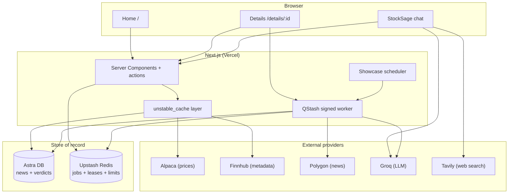
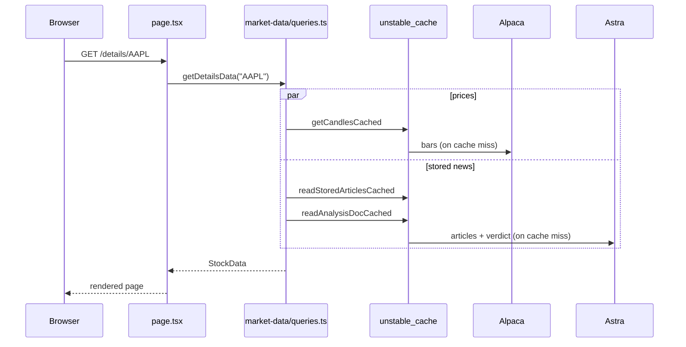
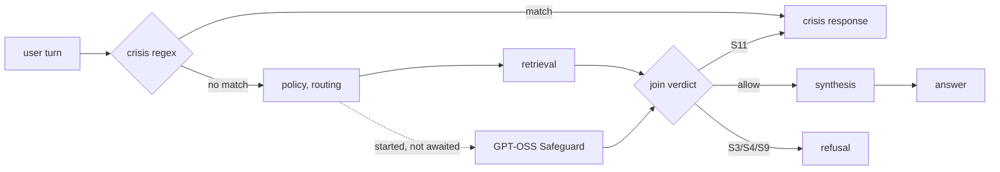

# Architecture

The design follows one rule: the request path only reads, and background jobs do the slow writing. This page covers the read path, how providers are split, caching, failure handling, and auth. The write path has its own page in [data-pipeline.md](data-pipeline.md).

## Why it's built this way

The free tiers are the constraint. Polygon news is rate-limited and QStash has
a daily message allowance. Calling providers or models on page loads would
couple user latency and availability to those limits.

Durable per-ticker jobs own scarce provider work. The hourly showcase scheduler
and authenticated long-tail visits publish the same deduplicated worker. Pages
read Astra plus cached price providers. When an upstream fails, the last
published bundle remains intact and the job retries outside the request.

## System overview

Pages read Astra, Alpaca, and Finnhub. Polygon and direct Groq market analysis
sit behind the durable worker.
Chat first screens the turn for crisis language, then applies a deterministic
domain policy, resolves typed conversation state, and builds a bounded evidence
plan.

## Serving a page

A request never fans out to a rate-limited provider. It reads the store and Alpaca, both fronted by `unstable_cache`.

If the published bundle is stale or missing, the browser reserves or joins a
durable job after first paint. It polls only job status with backoff. On
completion it fetches once and replaces the whole article/sentiment/verdict
generation. The page request itself performs no news ingestion or model work.

## Provider split

| Provider | Role | Where it runs |
|----------|------|---------------|
| Alpaca | Prices, candles, snapshots, movers | Read path |
| Finnhub | Company profile, peers, symbol search fallback | Read path |
| Polygon | News and per-article interim sentiment | Market-intelligence worker |
| Astra DB | Stored articles and per-ticker verdicts | Both |
| Groq | Market analysis, isolated chat models, and the GPT-OSS Safeguard input rail | Worker and chat |
| Tavily | Planned, filtered web evidence for current/comparison routes | Chat |

Prices resolve in order: Alpaca SIP history with a live IEX tail, then Polygon aggregates as a backup, then nothing. In live mode the UI shows an "unavailable" state rather than inventing a price.

## Search

Search hits a local index first. `src/data/universe.json` holds about 12,500 US tickers built from Alpaca's asset list, and `searchUniverse()` scans it in memory with a five-bucket score: exact symbol, symbol prefix, symbol substring, name prefix, name substring. Nothing in the universe touches the network. Finnhub is the only live fallback, for fuzzy company-name queries that miss locally.

## Caching

Reads go through `unstable_cache` with tag-based revalidation. The cron calls `revalidateTag("news")` after it writes, so fresh sentiment shows up without waiting for a timer.

| Data | Revalidate | Tag |
|------|-----------:|-----|
| Daily candles | 300s | `candles` |
| Intraday / fine candles | 300s | `candles` |
| Market movers map | 3600s | `movers` |
| Year-ago closes | 86400s | `movers` |
| Ticker detail / peers | 86400s | `fundamentals` |
| Symbol search | 86400s | `search` |
| Stored articles / verdict | 600s | `news` |

## StockSage execution

`src/lib/stocksage/chat.ts` is the stable public wrapper over one engine.
`engine.ts` gates the request, freezes one turn from `router.ts` and
`context.ts`, retrieves through `evidence/planner.ts` and
`evidence/retrieve.ts`, then calls the sole executor in `answer.ts`.
Retrieval reads revision-scoped cache and published market intelligence first,
computes entity-by-criterion gaps, and calls fundamentals or Tavily only for
uncovered cells. Regular synthesis uses direct Groq primary/fallback lanes;
deterministic ASX, proxy, ranking, concept, and degraded answers remain local.

Deep Research lives under `src/lib/stocksage/deep/`. Signed snapshots are
accepted by `queue.ts`, executed only by the signed QStash worker, and tracked
durably by `store.ts` through terminal success or failure. Queue outages never
fall back to inline work.

## Chat safety

Safety is two layers, because either one alone fails in a way the other covers.

**The prefilter** (`src/lib/stocksage/crisis.ts`) is a regex over a normalized form of the message: lowercased, punctuation stripped, stretched letters collapsed, so "KILL MY SELF" and "FUCKKKK" match the same patterns as their tidy spellings. It costs nothing, runs before entity resolution so a distressed message never reaches the market path on the strength of ticker-shaped words, and when it fires the turn returns the crisis response immediately. Nothing else runs, including the classifier.

**The classifier** (`src/lib/stocksage/safety-classifier.ts`) is GPT-OSS Safeguard on Groq with StockSage’s explicit JSON policy, and it exists because the prefilter can only catch phrasings someone thought of. It scores the current turn only; recent user context is added only for ambiguous distress language. It runs on turns that reach the answering pipeline, which is where a model-composed reply could be produced.

The classifier promise starts before retrieval and is awaited before synthesis, so on a normal finance turn its ~460ms hides entirely behind seconds of retrieval and adds no measurable wall clock, while still gating any model-composed reply. The verdict is checked before any reply leaves `answerChat`.

It acts on four of the fourteen MLCommons categories: `S11` (Suicide & Self-Harm) routes to the same crisis response as the prefilter, and `S3`, `S4`, `S9` refuse. Everything else is allowed through deliberately. `S6` (Specialized Advice) and `S2` (Non-Violent Crimes) matter most here: they fire on ordinary investment questions and on analysis of insider trading or market manipulation as subjects, which is the product's core function. Actual misconduct facilitation is refused deterministically in `policy.ts`, which does not depend on a model being reachable.

The rail fails open at every step. No key, open breaker, exhausted budget, HTTP error, unparseable output, or a verdict slower than 1,500ms all resolve to "allow" and the turn continues on the prefilter alone. A classifier outage degrades safety back to where it was before the classifier existed; it never takes chat down.

## Failure handling

Two mechanisms keep a flaky provider from becoming a broken page.

**Circuit breaker** (`src/lib/breaker.ts`) isolates retrieval providers and each Groq model lane. Three persistent failures inside ten minutes opens only that circuit; transient Groq 429s follow the server retry window and fail over without opening a ten-minute breaker. State lives in Redis so it is shared across serverless instances, with an in-process map as the local fallback. A shared synthesis admission limit prevents parallel chat requests from stampeding a model token bucket.

**Sliding rate limiter** (`src/lib/market-data/limiter.ts`) smooths outgoing bursts to each provider (Alpaca 180/min, Finnhub 50/min). It never rejects, it delays. Callers just `await acquire()`.

## Auth and user limits

Auth.js handles Google OAuth with JWT sessions (`src/auth.ts`, `src/auth.config.ts`, `src/middleware.ts`). Auth turns on only when `AUTH_SECRET` and a provider are configured; otherwise the app runs open in demo mode. When it is on, `/login` and the auth callbacks are the only public routes.

Every server action runs through `guard()` (`src/lib/guard.ts`), which rate limits per identity: the signed-in user id, or a hashed client IP when anonymous. Per-action limits are in [api.md](api.md).
