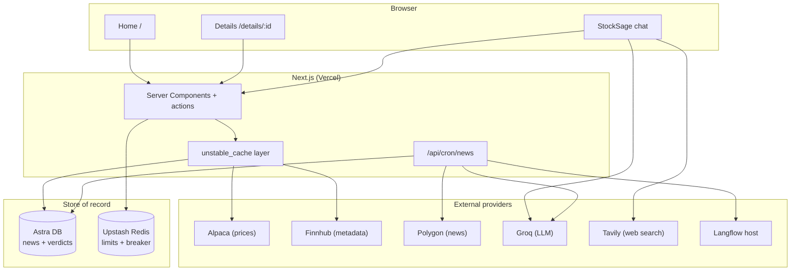
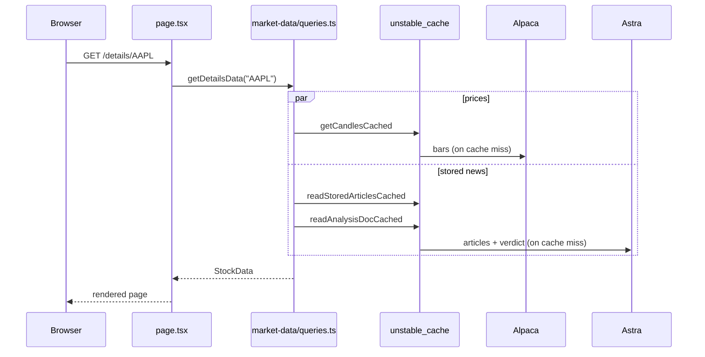

# Architecture

The design follows one rule: the request path only reads, and background jobs do the slow writing. This page covers the read path, how providers are split, caching, failure handling, and auth. The write path has its own page in [data-pipeline.md](data-pipeline.md).

## Why it's built this way

The free tiers are the constraint. Polygon news is 5 requests a minute. The Langflow host sleeps when idle and occasionally returns 503 for hours until someone restarts it. An early version called these providers on every page load, so a burst of clicks would exhaust the news budget and leave the UI stuck on "analyzing" or "unavailable".

Moving that work into a scheduled job fixes it. The cron owns the scarce providers and fills a database. Pages read the database plus Alpaca, which is fast (200 req/min) and reliable. When an upstream provider goes down, the cron retries on its next run and pages keep serving whatever is already stored.

## System overview

Pages read Astra, Alpaca, and Finnhub. Polygon and the batch LLM lane sit behind the cron. Chat first applies a deterministic domain policy, resolves typed conversation state, and builds a bounded evidence plan. Social, out-of-scope, code, and stable-finance turns skip retrieval; current and comparison routes call only planned quote, Astra, or Tavily providers. Eligible regular answers can launch idempotent deeper research through the same typed retrieval layer with broader queries and independent synthesis failover.

## Serving a page

A request never fans out to a rate-limited provider. It reads the store and Alpaca, both fronted by `unstable_cache`.

> If Astra has nothing for a ticker (a long-tail name the cron has not reached), the detail page kicks off a one-off priority analysis in the background, shows an "analyzing" badge, and polls until it lands (rate limited and single-flighted). It is the one spot where the request path triggers live analysis.

## Provider split

| Provider | Role | Where it runs |
|----------|------|---------------|
| Alpaca | Prices, candles, snapshots, movers | Read path |
| Finnhub | Company profile, peers, symbol search fallback | Read path |
| Polygon | Bulk news and per-article interim sentiment | Cron only |
| Astra DB | Stored articles and per-ticker verdicts | Both |
| Groq | Batch analysis plus isolated primary and fallback chat models | Cron and chat |
| Tavily | Planned, filtered web evidence for current/comparison routes | Chat |
| Langflow | Optional batch orchestration | Cron |

Prices resolve in order: Alpaca SIP history with a live IEX tail, then Polygon aggregates as a backup, then nothing. In live mode the UI shows an "unavailable" state rather than inventing a price.

## Search

Search hits a local index first. `src/data/universe.json` holds about 12,500 US tickers built from Alpaca's asset list, and `searchUniverse()` scans it in memory with a five-bucket score: exact symbol, symbol prefix, symbol substring, name prefix, name substring. Nothing in the universe touches the network. Finnhub is the only live fallback, for fuzzy company-name queries that miss locally.

## Caching

Reads go through `unstable_cache` with tag-based revalidation. The cron calls `revalidateTag("news")` after it writes, so fresh sentiment shows up without waiting for a timer.

| Data | Revalidate | Tag |
|------|-----------:|-----|
| Daily candles | 300s | `candles` |
| Intraday / fine candles | 300s | `candles` |
| Market movers map | 3600s | `movers` |
| Year-ago closes | 86400s | `movers` |
| Ticker detail / peers | 86400s | `fundamentals` |
| Symbol search | 86400s | `search` |
| Stored articles / verdict | 600s | `news` |

## Failure handling

Two mechanisms keep a flaky provider from becoming a broken page.

**Circuit breaker** (`src/lib/breaker.ts`) isolates Polygon, retrieval providers, Langflow analysis, and each Groq model lane. Three persistent failures inside ten minutes opens only that circuit; transient Groq 429s follow the server retry window and fail over without opening a ten-minute breaker. State lives in Redis so it is shared across serverless instances, with an in-process map as the local fallback. A shared synthesis admission limit prevents parallel chat requests from stampeding a model token bucket.

**Sliding rate limiter** (`src/lib/market-data/limiter.ts`) smooths outgoing bursts to each provider (Alpaca 180/min, Finnhub 50/min). It never rejects, it delays. Callers just `await acquire()`.

## Auth and user limits

Auth.js handles Google OAuth with JWT sessions (`src/auth.ts`, `src/auth.config.ts`, `src/middleware.ts`). Auth turns on only when `AUTH_SECRET` and a provider are configured; otherwise the app runs open in demo mode. When it is on, `/login` and the auth callbacks are the only public routes.

Every server action runs through `guard()` (`src/lib/guard.ts`), which rate limits per identity: the signed-in user id, or a hashed client IP when anonymous. Per-action limits are in [api.md](api.md).
