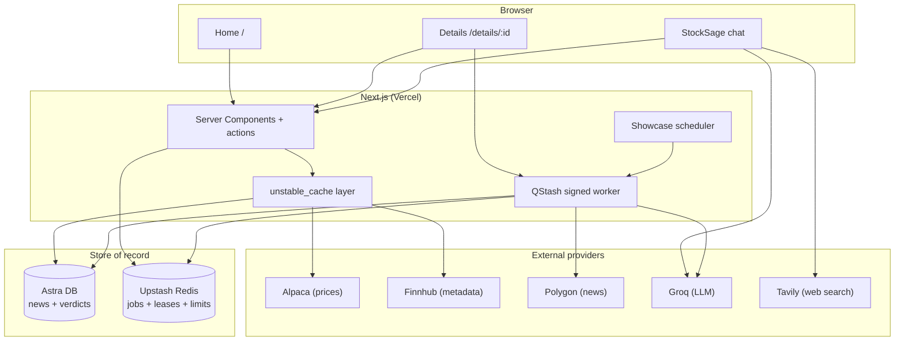
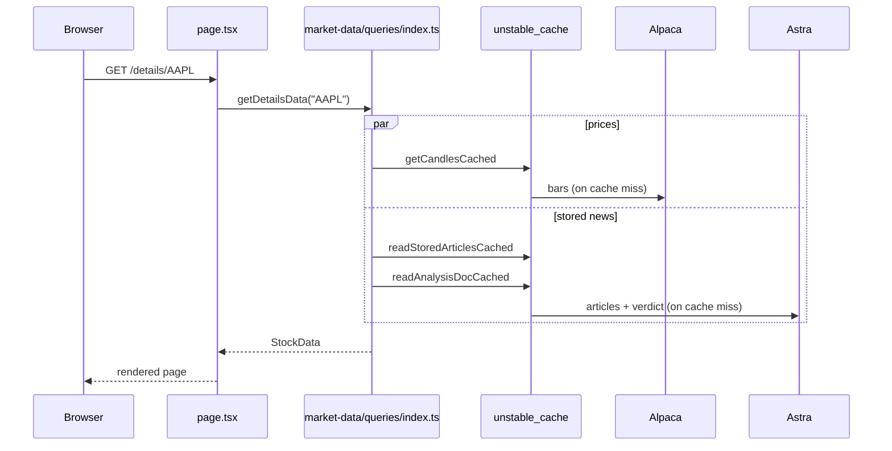
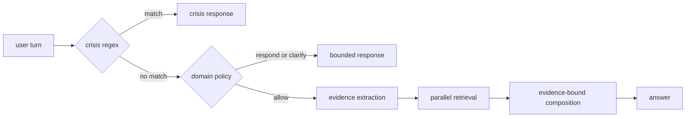

# Architecture

The design follows one rule: the request path only reads, and background jobs do the slow writing. This page covers the read path, how providers are split, caching, failure handling, and auth. The write path has its own page in [data-pipeline.md](data-pipeline.md).

## Why it's built this way

The free tiers are the constraint. Polygon news is rate-limited and QStash has
a daily message allowance. Calling providers or models on page loads would
couple user latency and availability to those limits.

Durable per-ticker jobs own scarce provider work. The 30-minute showcase scheduler
and authenticated long-tail visits publish the same deduplicated worker. Pages
read Astra plus cached price providers. When an upstream fails, the last
published bundle remains intact and the job retries outside the request.

## System overview

Pages read Astra, Alpaca, and Finnhub. Polygon and direct Groq market analysis
sit behind the durable worker.
Chat first resolves typed conversation state, then screens the turn for crisis
language, applies a deterministic domain policy, and builds a bounded evidence
plan.

## Serving a page

A request never fans out to a rate-limited provider. It reads the store and Alpaca, both fronted by `unstable_cache`.

If the published bundle is stale or missing, the browser reserves or joins a
durable job after first paint. It polls only job status with backoff. On
completion it fetches once and replaces the whole article/sentiment/verdict
generation. The page request itself performs no news ingestion or model work.

## Provider split

| Provider | Role | Where it runs |
|----------|------|---------------|
| Alpaca | Prices, candles, snapshots, movers | Read path |
| Finnhub | Company profile, peers, symbol search fallback | Read path |
| Polygon | News and per-article interim sentiment | Market-intelligence worker |
| Astra DB | Stored articles and per-ticker verdicts | Both |
| Groq | Market analysis and isolated chat models | Worker and chat |
| Tavily | Planned, filtered web evidence for current/comparison routes | Chat |

Prices resolve in order: Alpaca SIP history with a live IEX tail, then Polygon aggregates as a backup, then nothing. In live mode the UI shows an "unavailable" state rather than inventing a price.

## Search

Search hits a local index first. `src/data/universe.json` holds about 12,500 US tickers built from Alpaca's asset list, and `searchUniverse()` scans it in memory with a five-bucket score: exact symbol, symbol prefix, symbol substring, name prefix, name substring. Nothing in the universe touches the network. Finnhub is the only live fallback, for fuzzy company-name queries that miss locally.

## Caching

Reads go through `unstable_cache` with tag-based revalidation. The cron calls `revalidateTag("news")` after it writes, so fresh sentiment shows up without waiting for a timer.

| Data | Revalidate | Tag |
|------|-----------:|-----|
| Daily candles | 300s | `candles` |
| Intraday / fine candles | 300s | `candles` |
| Market movers map | 3600s | `movers` |
| Year-ago closes | 86400s | `movers` |
| Ticker detail / peers | 86400s | `fundamentals` |
| Symbol search | 86400s | `search` |
| Stored articles / verdict | 600s | `news` |

## StockSage execution

`src/lib/stocksage/chat.ts` is the stable public wrapper around
`simple-runtime.ts`. Each finance turn follows one pipeline:

1. Resolve bounded v1 conversation state, entity references, and temporal hints.
2. Apply the deterministic crisis and finance-domain policy floor.
3. Ask the selected LLM to extract price, focused-news, and ranking needs.
4. Retrieve range bars, published Astra evidence, Tavily results, and supported
   US rankings in parallel.
5. Ask the LLM to compose from that evidence, then expand only validated
   citation URLs into the reply.

StockSage can use Cerebras or Groq as its primary LLM and fails over to the
other provider only for missing-provider, network, rate-limit, and server
failures. Market data remains deterministic and provider-labelled.

## Chat safety

`src/lib/stocksage/policy/crisis.ts` normalizes and detects explicit self-harm,
acute distress, and violence language before any retrieval or model call.
`src/lib/stocksage/policy/index.ts` then enforces the finance-domain boundary,
high-stakes guidance limits, and misuse refusals.

## Failure handling

Two mechanisms keep a flaky provider from becoming a broken page.

**Circuit breaker** (`src/lib/resilience/breaker.ts`) isolates retrieval providers. Three
persistent failures inside ten minutes opens only that circuit. State lives in
Redis so it is shared across serverless instances, with an in-process map as
the local fallback. StockSage LLM requests use direct cross-provider failover.

**Sliding rate limiter** (`src/lib/market-data/providers/limiter.ts`) smooths outgoing bursts to each provider (Alpaca 180/min, Finnhub 50/min). It never rejects, it delays. Callers just `await acquire()`.

## Auth and user limits

Auth.js handles Google OAuth with JWT sessions (`src/auth.ts`, `src/auth.config.ts`, `src/middleware.ts`). Auth turns on only when `AUTH_SECRET` and a provider are configured; otherwise the app runs open in demo mode. When it is on, `/login` and the auth callbacks are the only public routes.

Every server action runs through `guard()` (`src/lib/resilience/guard.ts`), which rate limits per identity: the signed-in user id, or a hashed client IP when anonymous. Per-action limits are in [api.md](api.md).
