# Data pipeline

The details request is store-first. It reads cached prices and one published
market-intelligence bundle; it never waits for news providers or an LLM.

## Triggers

The same ticker worker has two triggers:

- `/api/cron/showcase` publishes the ten canonical showcase tickers hourly,
  staggered by one minute.
- An authenticated stale or cold details page reserves or joins one on-demand
  job after first paint.

The daily `/api/cron/maintenance` route only prunes retained articles. The old
universe cursor and `/api/cron/news` execution path are retired.

## Durable job path

```mermaid
flowchart LR
  Trigger["Showcase or user trigger"] --> Reserve["Redis active ticker + work ID"]
  Reserve --> QStash["QStash signed delivery"]
  QStash --> Worker["Ticker refresh worker"]
  Worker --> Candidate["Fetch and fingerprint candidate articles"]
  Candidate --> Analysis["Reuse verdict or run direct Groq"]
  Analysis --> Publish["CAS-publish exact article manifest"]
  Publish --> Cache["Invalidate ticker cache and mark done"]
```



Redis provides one active work ID per ticker, durable job state, and a
renewable owner-token lease. Duplicate visits join the existing work ID.
QStash uses that ID for delivery deduplication and makes three total attempts.
A signed failure callback records terminal state and a retry cooldown.

## Sequential publication

The worker:

1. Normalizes the ticker and acquires its lease.
2. Checks `news_checked_at`; it contacts Polygon, with Alpaca fallback, only
   when the one-hour news-check window has expired.
3. Upserts articles by stable URL-derived ID and selects the newest 25 eligible
   articles from the retained 90-day corpus.
4. Computes a deterministic content fingerprint. Prompt, model, and response
   schema versions form the analysis fingerprint.
5. Reuses the existing verdict when that full fingerprint is unchanged;
   otherwise it runs and validates direct Groq analysis.
6. Applies validated article labels.
7. Publishes the analysis document last using an exact generation
   compare-and-set.

The analysis document contains `published_article_ids`. Details reads only
those exact rows, in manifest order. Articles staged before the final write
cannot appear beside a verdict from another generation.

An obsolete worker fails its generation comparison and cannot overwrite newer
work. Every exit path conditionally releases only the lease it owns.

## Freshness and retention

Freshness, analysis age, and retention are separate:

- `news_checked_at` no more than one hour old plus a matching fingerprint is
  fresh.
- From one hour to under 48 hours, the last published bundle remains visible
  as a previous snapshot while a refresh runs.
- At 48 hours, the bundle is not presented as current.
- `analyzed_at` may be older when a recent provider check confirms that the
  article fingerprint is unchanged.
- Articles remain stored for 90 days so StockSage can answer temporal queries.

A successful empty provider result publishes `no_news`. After exhausted model
failures, a ticker with newly loaded articles may publish an explicit
news-only bundle with analysis marked unavailable. Provider failure never
creates sample news in production.

## Scheduling and operations

`scripts/setup-qstash.ts` reconciles the hourly showcase and daily maintenance
schedules and removes the retired universe-news and keep-warm schedules.

```bash
npm run ops:qstash
npm run ops:showcase
```

The first command changes external schedules and requires QStash credentials.
The second invokes the showcase endpoint for a manual authenticated diagnostic.

Relevant controls:

- `CRON_SECRET` authenticates showcase and maintenance routes.
- `MARKET_INTELLIGENCE_ON_DEMAND_DAILY_BUDGET` defaults to 300 new user jobs.
- `MARKET_INTELLIGENCE_USER_DAILY_LIMIT` defaults to 20 requests per user.
- QStash token/signing keys, `APP_URL`, and Upstash Redis are mandatory for the
  production refresh queue.
