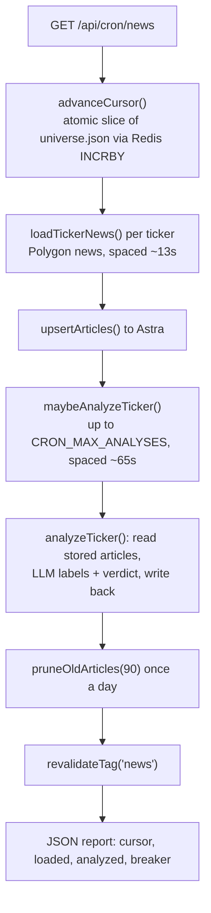

# Data pipeline

The write side of the app. A scheduled job fetches news, runs sentiment analysis, and writes both to Astra DB, so the [request path](architecture.md) only ever reads. Nothing here runs while a user waits.

## Trigger

Everything runs behind one endpoint, `/api/cron/news`, protected by a bearer token (`CRON_SECRET`). QStash drives it and Vercel provides a daily backstop:

| Scheduler | Cadence | Defined in |
|-----------|---------|------------|
| Upstash QStash | Every 5 minutes | `scripts/setup-qstash.ts` |
| Vercel cron | Once a day (backstop) | `vercel.json` |

`.github/workflows/news-cron.yml` remains available for manual diagnostics and
fails unless the endpoint returns HTTP 200 with a valid run report.

> Freshness is measured in days, not minutes (see [Two clocks](#two-clocks) below), so the schedule can stay loose without changing anything a user sees.

## One pass



The cursor is a Redis counter, so each run picks up a fresh slice of the ticker universe and the whole list rotates over time. A partial run does not restart from the top; the next run continues from the cursor. Weekends halve the batch size, since little news breaks on a Saturday. A soft deadline of about 250s stops the run before the serverless timeout.

## Fetching news

`fetchPolygonNewsWithInsights()` pulls the last 90 days of articles for a ticker from Polygon's news endpoint. Polygon attaches its own per-article sentiment for free, so those labels go in as an interim read (`label_source: "polygon"`) the moment the article is stored. The sentiment gauge is populated before any LLM has run.

Each article gets a stable id derived from its URL, so re-fetching the same story updates the row instead of duplicating it. If the Polygon breaker is open, the run skips the remaining news loads for that pass.

## Analyzing sentiment

After news loads, the same run analyzes a few tickers. `shouldAnalyzeTicker()` decides who is due: a ticker qualifies if it has articles and has either never been analyzed, was analyzed more than three days ago, or has loaded newer articles since its last analysis.

`analyzeTicker()` reads up to 200 stored articles, trims to the most recent 25, sends them to the LLM, and validates the JSON response against a Zod schema. On a clean pass it does two things:

1. Writes per-article labels back to the articles, marked `label_source: "ai"` so a later news re-fetch cannot downgrade them to the interim Polygon labels.
2. Writes a per-ticker verdict document (overall sentiment, score, summary, key drivers, risks) and stamps `analyzed_at`.

> `analyzed_at` is set only on full success, and freshness is judged from that stamp and nothing else. Judging staleness from article publish dates (the earlier approach) made week-old news look permanently stale and re-trigger analysis forever.

A per-ticker single-flight lock (a 10-minute Redis claim) stops two runs, or a run and a page-triggered priority pass, from analyzing the same ticker at once.

## Two clocks

Refresh and retention are deliberately separate.

- **Refresh:** re-analyze when `analyzed_at` is older than three days.
- **Retention:** keep 90 days of articles, pruned by publish date once a day.

The 90-day window is what the sentiment chart draws, and it doubles as the outage cushion. If the pipeline is down for a day or two, tickers show an honest "analyzed N days ago" instead of going blank.

## The LLM lane

Batch analysis remains Langflow-first with a direct-Groq fallback and uses the 8B model (`llama-3.1-8b-instant`). Its Groq and Langflow breakers are isolated from interactive chat. Regular chat uses selective typed evidence plans and the 70B model (`llama-3.3-70b-versatile`). Langflow's 70B RAG flow runs only from an eligible response's Research deeper action. Full flow detail is in [langflow/README.md](../langflow/README.md).

## Running it by hand

All three scripts need `NODE_OPTIONS="--conditions=react-server"`, which `tsx` picks up from the scripts themselves.

```bash
# one full ingestion pass against your .env.local
npx tsx scripts/run-cron.ts --batch 8 --analyses 3

# load news for a single ticker and read it back
npx tsx scripts/load-news.ts NVDA

# analyze one ticker (add --force to ignore the freshness check)
npx tsx scripts/analyze-ticker.ts NVDA --force
```

## Knobs

| Variable | Default | Effect |
|----------|--------:|--------|
| `CRON_BATCH_SIZE` | 8 | Tickers loaded per run |
| `CRON_MAX_ANALYSES` | 3 | LLM analyses per run |
| `CRON_SECRET` | none | Bearer token the route requires |
