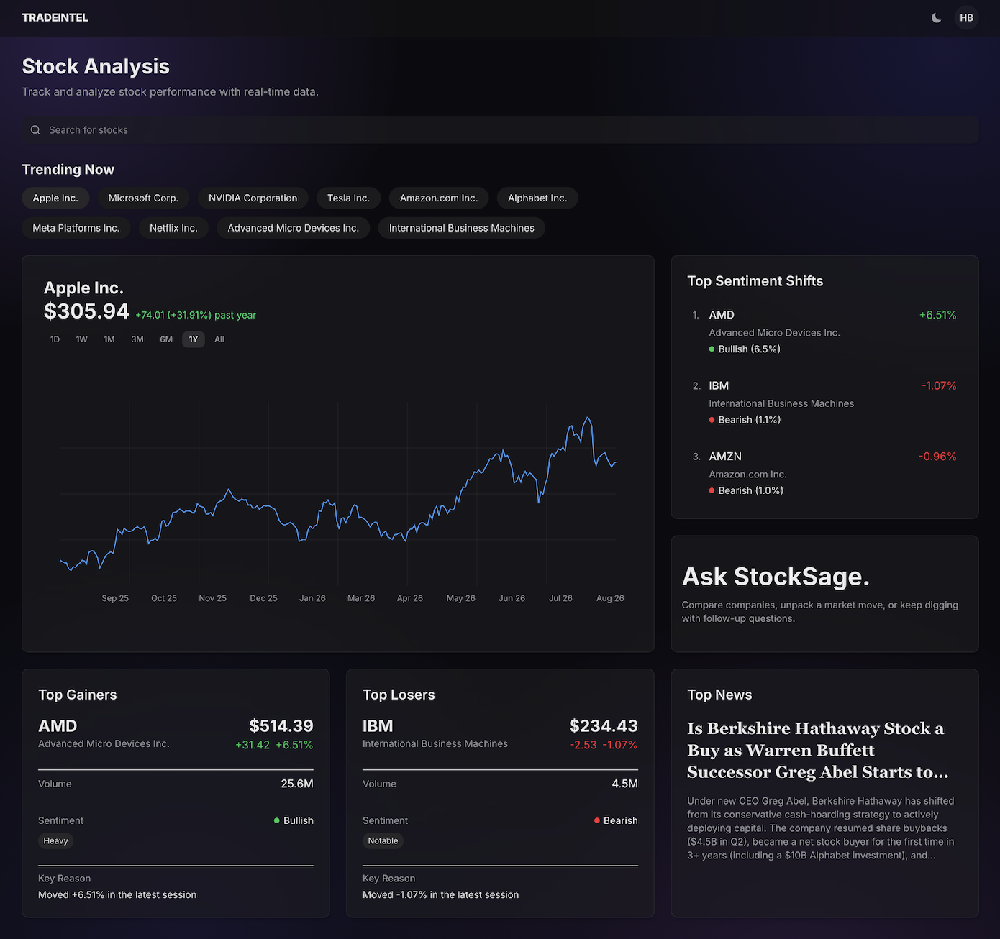
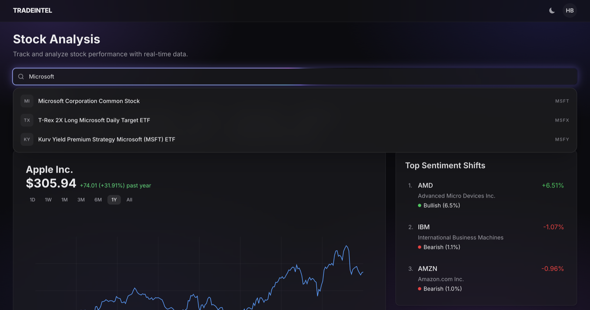
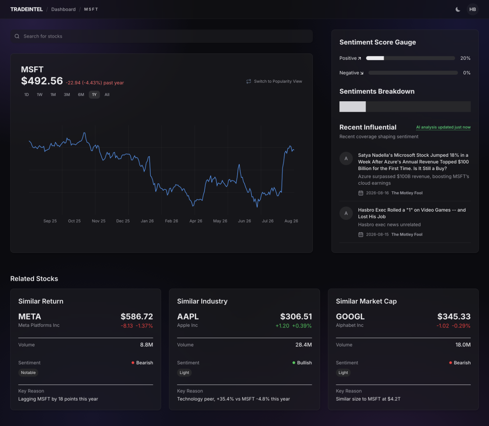
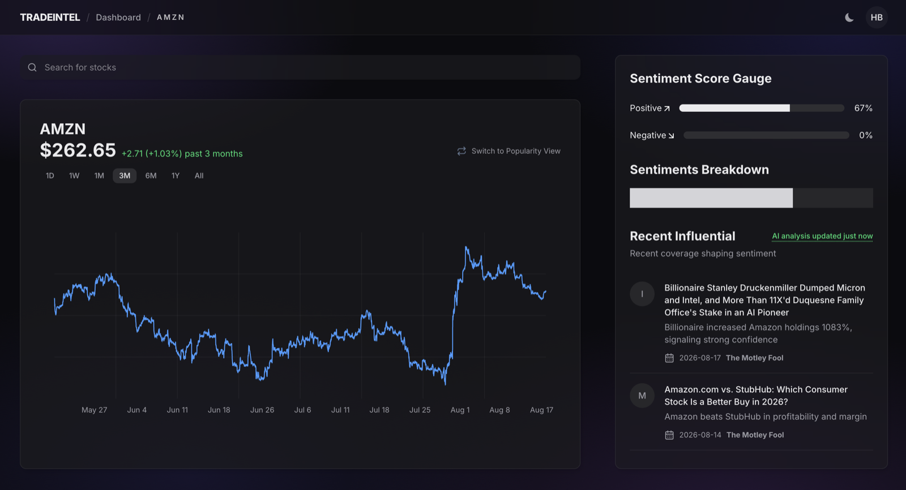
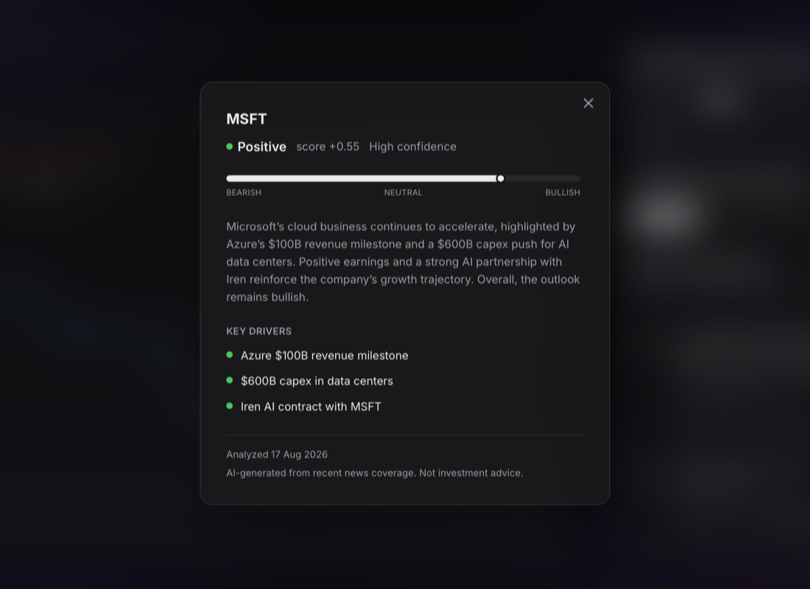
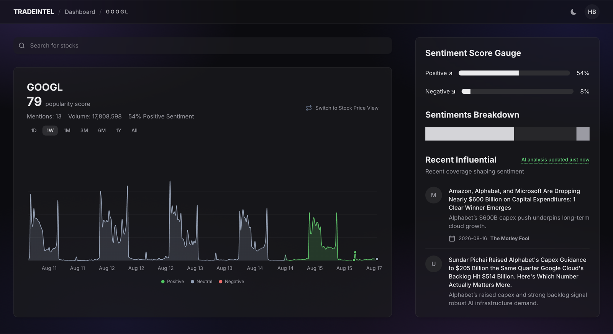
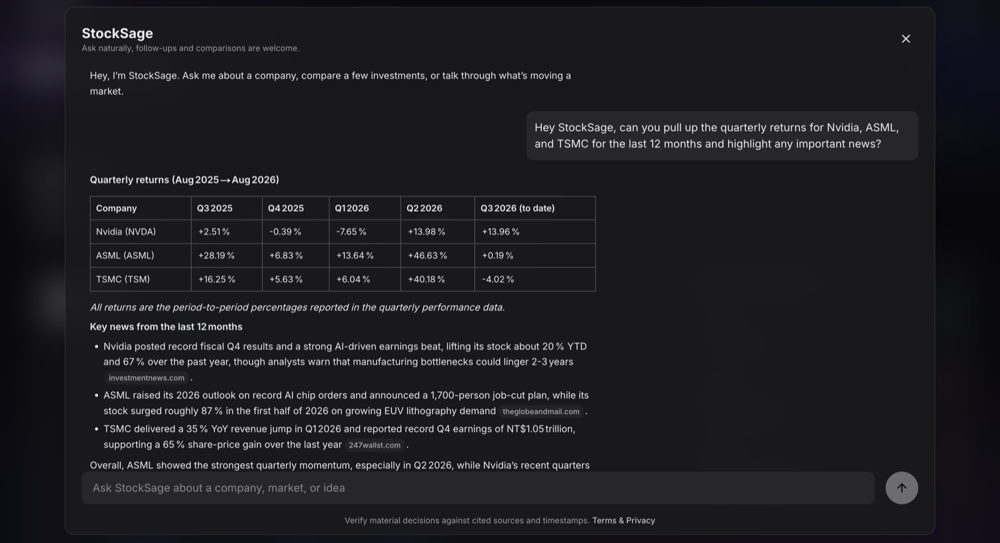
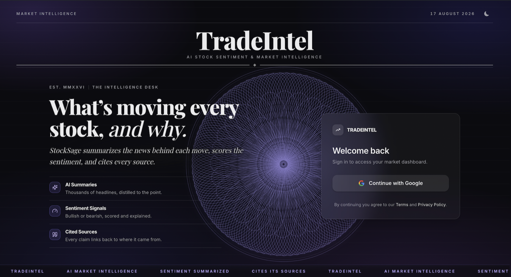

# Screenshots

A quick visual tour of TradeIntel.

### Home

Featured stock chart, top movers, and the latest headline on one screen.

### Search

Local search over ~12,500 tickers, results as you type with no network round-trip.

### Stock detail

Price history, trading volume, market context, and related companies for one ticker.

### Sentiment and news

The articles driving the current read, with per-story sentiment and analysis freshness.

### Analytical verdict

The current conclusion, confidence, summary, and key market drivers.

### Popularity view

The price card flipped into its sentiment and article-activity view.

### StockSage chat

An evidence-grounded stock research answer with its supporting citations.

### Sign in

Google sign-in over the animated guilloche background.
