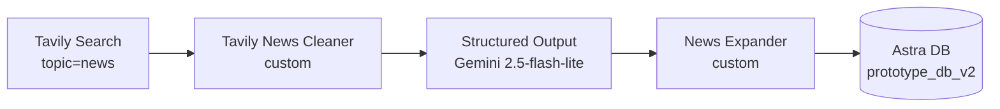
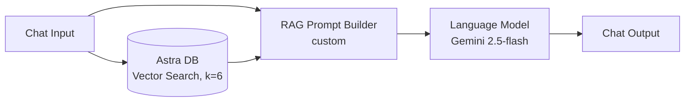

# StockSage — Langflow Flows

StockSage's AI lives in two [Langflow](https://www.langflow.org/) flows (v1.10).
The Next.js app never talks to an LLM directly — it calls these flows over HTTP,
so the AI is swappable, inspectable, and hosted independently.

```
                ┌──────────────────────── Vercel (Next.js) ────────────────────────┐
                │  visit /details/NVDA                 chat: "sentiment on NVDA?"    │
                └─────────┬───────────────────────────────────────┬─────────────────┘
                          │ POST /run/<ingest_id> (tweaks)         │ POST /run/<chat_id>
                          ▼                                        ▼
        ┌──────────────────────────────┐          ┌──────────────────────────────┐
        │  stocksage-ingestion.json     │          │  stocksage-chat.json          │
        │  (writes news → Astra)        │          │  (reads news ← Astra, RAG)    │
        └───────────────┬──────────────┘          └───────────────┬──────────────┘
                        write                                     read
                          └──────────────▶  Astra DB  ◀──────────────┘
                                       (prototype_db_v2,
                                        gemini-embedding-001)
```

Both flows share the **same Astra collection** (`prototype_db_v2`) and the **same
embedding model** (`gemini-embedding-001`) — that's what makes retrieval meaningful:
the chat flow searches exactly the vectors the ingestion flow wrote.

---

## 1. `stocksage-ingestion.json` — News ETL

Pulls fresh web news for a ticker, has Gemini structure it, and writes one
embeddable document per article into Astra.



| Node | Type | Role |
|------|------|------|
| `TavilySearchComponent-wBPu4` | Tavily Search | Recent (7-day) financial news for the query. **ID is stable** — the app overrides `query` per ticker. |
| `TavilyNewsCleaner-clean` | custom | DataFrame → clean `TITLE/URL/CONTENT` blocks split by `---`; de-dupes by URL. |
| `StructuredOutput-5fgb3` | Structured Output | Gemini extracts a row per article (10 fields). **ID is stable** — the app overrides `system_prompt` per ticker. |
| `NewsExpander-expand` | custom | Flattens rows → Astra docs. Stamps `ingested_at`, **normalises `sentiment`/`importance` to capitalised enums**, guarantees non-empty `page_content`. |
| `AstraDB-ingest` | Astra DB | Embeds + upserts into `prototype_db_v2`. |

**Per-ticker reuse:** one flow serves every ticker. The app sends Langflow
`tweaks` that repoint `…wBPu4.query` and `…5fgb3.system_prompt` at the requested
symbol (see `src/lib/news-ingest.ts`).

**Free-tier aware:** uses `gemini-2.5-flash-lite`; the app dedupes ingestion to
once / 6h / ticker and a daily cron pre-warms a curated list — all to stay under
Gemini's ~20 req/day free quota.

## 2. `stocksage-chat.json` — RAG chat

Answers questions grounded in the ingested news.



| Node | Type | Role |
|------|------|------|
| `ChatInput-chat` | Chat Input | User message (also the search query). |
| `AstraDB-search` | Astra DB | Vector search over `prototype_db_v2`, top 6. |
| `StockSageRagPrompt-rag` | custom | Merges retrieved articles + question into one grounded prompt; handles the empty-context case. |
| `LanguageModelComponent-chat` | Language Model | Gemini 2.5-flash answers from the prompt. |
| `ChatOutput-chat` | Chat Output | Returns the reply. |

**Why no agent / tools?** Chained tool-agents made Gemini throw
`400 "single turn requests must end with a user role"`. Retrieval is a plain
vector search stitched into a single user prompt — deterministic and robust.

---

## Importing into hosted Langflow

1. **Global variable** (Settings → Global Variables, type *Credential*):
   `GOOGLE_API_KEY` = your Gemini key. Used by the chat LLM, the extractor, and
   Astra's embeddings.
2. **Import** both JSON files (Projects → Import).
3. Open each flow and set secrets that import blank by design:
   - Astra DB node → **Astra DB Application Token**; confirm DB/collection shows
     `prototype_db_v2` (re-select after the token is set if the dropdown is empty).
   - Tavily Search node → **Tavily API Key** (ingestion only).
4. **Playground test:** run ingestion (expect ~6 AAPL rows in Astra), then ask
   the chat *"What's the latest sentiment on AAPL?"* — it should cite those rows.
5. Copy each flow's id from its URL (`…/flow/<ID>`) into the app env:
   - `LANGFLOW_INGEST_FLOW_ID` ← ingestion flow
   - `LANGFLOW_FLOW_ID` ← chat flow
