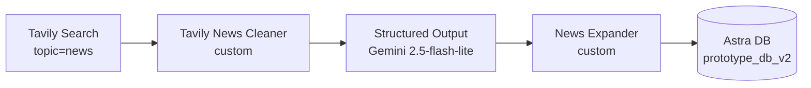
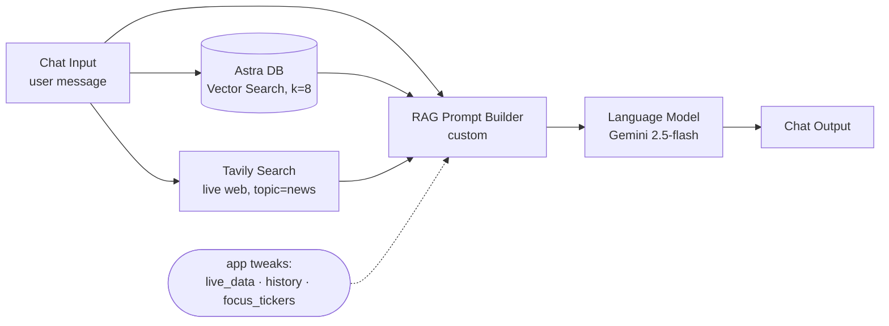

# StockSage — Langflow Flows

StockSage's AI lives in two [Langflow](https://www.langflow.org/) flows (v1.10).
The Next.js app never talks to an LLM directly — it calls these flows over HTTP,
so the AI is swappable, inspectable, and hosted independently.

```
                ┌──────────────────────── Vercel (Next.js) ────────────────────────┐
                │  visit /details/NVDA                 chat: "sentiment on NVDA?"    │
                └─────────┬───────────────────────────────────────┬─────────────────┘
                          │ POST /run/<ingest_id> (tweaks)         │ POST /run/<chat_id>
                          ▼                                        ▼
        ┌──────────────────────────────┐          ┌──────────────────────────────┐
        │  stocksage-ingestion.json     │          │  stocksage-chat.json          │
        │  (writes news → Astra)        │          │  (reads news ← Astra, RAG)    │
        └───────────────┬──────────────┘          └───────────────┬──────────────┘
                        write                                     read
                          └──────────────▶  Astra DB  ◀──────────────┘
                                       (prototype_db_v2,
                                        gemini-embedding-001)
```

Both flows share the **same Astra collection** (`prototype_db_v2`) and the **same
embedding model** (`gemini-embedding-001`) — that's what makes retrieval meaningful:
the chat flow searches exactly the vectors the ingestion flow wrote.

---

## 1. `stocksage-ingestion.json` — News ETL

Pulls fresh web news for a ticker, has Gemini structure it, and writes one
embeddable document per article into Astra.



| Node | Type | Role |
|------|------|------|
| `TavilySearchComponent-wBPu4` | Tavily Search | Recent (7-day) financial news for the query. **ID is stable** — the app overrides `query` per ticker. |
| `TavilyNewsCleaner-clean` | custom | DataFrame → clean `TITLE/URL/CONTENT` blocks split by `---`; de-dupes by URL. |
| `StructuredOutput-5fgb3` | Structured Output | Gemini extracts a row per article (10 fields). **ID is stable** — the app overrides `system_prompt` per ticker. |
| `NewsExpander-expand` | custom | Flattens rows → Astra docs. Stamps `ingested_at`, **normalises `sentiment`/`importance` to capitalised enums**, guarantees non-empty `page_content`. |
| `AstraDB-ingest` | Astra DB | Embeds + upserts into `prototype_db_v2`. |

**Per-ticker reuse:** one flow serves every ticker. The app sends Langflow
`tweaks` that repoint `…wBPu4.query` and `…5fgb3.system_prompt` at the requested
symbol (see `src/lib/news-ingest.ts`).

**Free-tier aware:** uses `gemini-2.5-flash-lite`; the app dedupes ingestion to
once / 6h / ticker and a daily cron pre-warms a curated list — all to stay under
Gemini's ~20 req/day free quota.

## 2. `stocksage-chat.json` — RAG chat

Answers questions grounded in the ingested news **and** live market figures.



| Node | Type | Role |
|------|------|------|
| `ChatInput-k6AeC` | Chat Input | The user message. Drives both the vector search and the live web search. |
| `AstraDB-WBI01` | Astra DB | Vector search over `prototype_db_v2`, top 8, with reranking. |
| `TavilySearchComponent-LyDPQ` | Tavily Search | **Live web search on the question** (topic=news, advanced, 5 results). Gives up-to-date context on *any* entity — new listings, private companies, indices, foreign ADRs — not just tickers already in Astra. |
| `StockSageRagPrompt-FwmYE` | custom | Builds one grounded prompt from the question, **live web results**, retrieved news, and the app-supplied grounding (below). Keeps a news item when it matches a `focus_tickers` entry **or mentions a subject from the question**, so a relevant cross-tagged story still surfaces; orders by importance/recency. |
| `LanguageModelComponent-0ZJmW` | Language Model | Gemini 2.5-flash. A strict "sharp analyst" system message forces quantitative, decisive, source-cited answers, treats the supplied web/live/news context as current truth, and bans hedging/boilerplate. |
| `ChatOutput-HXFDh` | Chat Output | Returns the reply. |

**Why live web search in chat?** The Astra store only holds news for tickers that
have been ingested, so a pure vector RAG can only speak to the warmed set. The
Tavily node gives every answer fresh, broad web coverage of whatever was asked,
while Astra adds depth on warmed names and the app supplies exact live figures.
This is the flow doing **live web RAG + vector RAG + real-time grounding** in one
pass — the centrepiece of the project.

**Grounding via tweaks (the key design point).** The Next.js app does NOT stuff
live numbers and history into the search query (that pollutes retrieval).
Instead it sends the clean message as `input_value` and injects three fields
into the RAG Prompt Builder via Langflow `tweaks` (see `src/app/actions.ts`):

| Tweak field | What the app sends |
|-------------|--------------------|
| `live_data` | Real price / % change / volume for tickers mentioned in the turn. |
| `history` | The last few conversation turns, so follow-ups keep their subject. |
| `focus_tickers` | Tickers in scope, so retrieved news is filtered on-subject. |

**Why no agent / tools?** Chained tool-agents made Gemini throw
`400 "single turn requests must end with a user role"`. Retrieval is a plain
vector search stitched into a single user prompt — deterministic and robust.

> **After editing these flows, re-import them into your hosted Langflow** for the
> changes to take effect (the app talks to the *hosted* flow, not this file).
> The RAG Prompt Builder's `live_data` / `history` / `focus_tickers` inputs and
> the analyst system message ship inside the JSON, so a fresh import is all the
> hosted instance needs. If your Langflow assigns a new flow id on import, update
> `LANGFLOW_FLOW_ID`; the node IDs above are preserved by import and are what
> `config.ts` / the tweaks target.

---

## Importing into hosted Langflow

1. **Global variable** (Settings → Global Variables, type *Credential*):
   `GOOGLE_API_KEY` = your Gemini key. Used by the chat LLM, the extractor, and
   Astra's embeddings.
2. **Import** both JSON files (Projects → Import).
3. Open each flow and set secrets that import blank by design:
   - Astra DB node → **Astra DB Application Token**; confirm DB/collection shows
     `prototype_db_v2` (re-select after the token is set if the dropdown is empty).
   - Tavily Search node → **Tavily API Key**. **Both flows** now use Tavily: the
     ingestion flow to fetch news, and the chat flow for live web search. Set the
     same key on each (or promote it to a *Credential* global variable and select
     it on both nodes).
4. **Playground test:** run ingestion (expect ~6 AAPL rows in Astra), then ask
   the chat *"How is Tesla vs SpaceX doing?"* — it should pull fresh web context
   and answer with specifics, then a follow-up *"vs IXIC?"* should resolve the
   prior subject and name the Nasdaq Composite.
5. Copy each flow's id from its URL (`…/flow/<ID>`) into the app env:
   - `LANGFLOW_INGEST_FLOW_ID` ← ingestion flow
   - `LANGFLOW_FLOW_ID` ← chat flow
